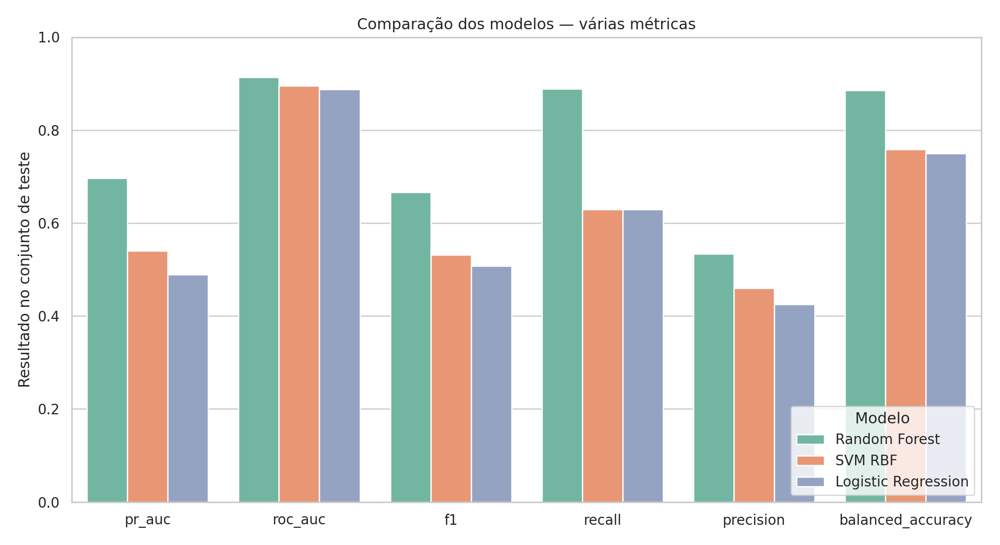
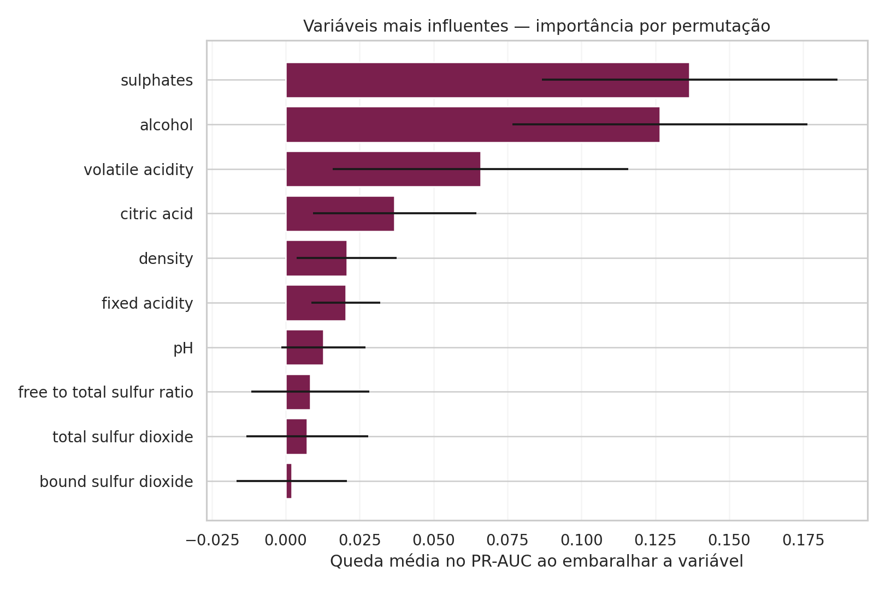

# Classificação da qualidade de vinhos

Tech Challenge — Fase 2 | Pós-Tech Data Analytics — FIAP

Projeto de classificação binária que estima se um vinho tinto receberá nota **igual ou superior a 7** a partir de 11 medições físico-químicas. A solução foi construída como apoio à triagem de lotes; ela não substitui a avaliação sensorial de enólogos.

## Resultado executivo

Após retirar o identificador e 125 registros físico-químicos duplicados, foram analisadas **1.018 amostras**. Apenas **13,5%** pertencem à classe de alta qualidade, portanto acurácia isolada não é uma métrica suficiente.

O melhor modelo foi o **Random Forest**, avaliado em um teste estratificado de 204 amostras nunca utilizado no ajuste:

| Métrica | Resultado |
|---|---:|
| PR-AUC | 0,697 |
| ROC-AUC | 0,914 |
| Recall — alta qualidade | 0,889 |
| Precisão — alta qualidade | 0,533 |
| F1 — alta qualidade | 0,667 |
| Acurácia balanceada | 0,885 |
| Acurácia geral | 0,882 |

O limiar operacional foi reduzido de 0,50 para **0,207**, definido com previsões out-of-fold apenas do treino para maximizar F1. A escolha favorece a triagem: encontra 88,9% dos vinhos de alta qualidade, aceitando mais falsos positivos para posterior avaliação humana.



## Principais achados

- **Álcool** tem a maior associação linear positiva com alta qualidade (`r = 0,410`).
- **Acidez volátil** tem associação negativa (`r = -0,302`), coerente com seu uso como indicador de deterioração quando elevada.
- **Ácido cítrico** (`r = 0,237`) e **sulfatos** (`r = 0,213`) apresentam associação positiva moderada/fraca.
- Na importância por permutação do modelo vencedor, **sulfatos, álcool e acidez volátil** são os três sinais mais úteis.
- Correlação não prova causalidade. As variáveis devem orientar investigação e controle de processo, não alterações isoladas de formulação.



## Correlações entre variáveis

As correlações fortes foram avaliadas porque podem indicar informações parcialmente redundantes:

| Relação | `r` | Justificativa analítica |
|---|---:|---|
| SO₂ total × SO₂ ligado | 0,961 | O SO₂ ligado foi criado como `total - livre`; a relação alta é esperada. |
| Acidez fixa × pH | -0,693 | Mais ácidos não voláteis tendem a reduzir o pH, embora capacidade tampão impeça relação perfeita. |
| Acidez fixa × densidade | 0,683 | Maior concentração de sólidos e ácidos pode acompanhar maior densidade. |
| Acidez fixa × ácido cítrico | 0,668 | Ácido cítrico compõe a acidez titulável e pode variar junto dos demais ácidos fixos. |
| SO₂ livre × SO₂ total | 0,661 | O SO₂ livre faz parte do total; ambos refletem o manejo de conservação. |
| Ácido cítrico × pH | -0,553 | Maior presença de ácido tende a acompanhar menor pH. |
| Acidez volátil × ácido cítrico | -0,542 | Pode refletir perfis de processo e conservação distintos; não implica causalidade direta. |
| Densidade × álcool | -0,505 | A fermentação converte açúcares em álcool e reduz densidade; o etanol também é menos denso que a água. |

A feature `SO₂ ligado` é mantida como experimento de engenharia de atributos, mas sua redundância é tratada naturalmente pelos modelos. Para regressão logística, a regularização reduz instabilidade.

## Outliers e consistência

Não há dados faltantes. Outliers foram identificados pelo critério de **1,5 × IQR**; açúcar residual (9,3%) e cloretos (7,0%) concentram mais valores extremos. Eles foram preservados porque podem representar variação química real e porque a remoção automática poderia apagar justamente vinhos raros. Os limites completos estão em [`results/outlier_summary.csv`](results/outlier_summary.csv).

## Metodologia

1. `quality >= 7` → classe 1; demais notas → classe 0.
2. Remoção de `Id` e de duplicatas exatas após excluir o identificador.
3. Engenharia de atributos: SO₂ ligado e razão SO₂ livre/total.
4. Divisão estratificada: 80% treino e 20% teste.
5. Comparação de Regressão Logística, Random Forest e SVM RBF.
6. Busca de hiperparâmetros com validação cruzada estratificada de 5 folds, otimizando PR-AUC.
7. Limiar escolhido por F1 em previsões out-of-fold do treino.
8. Avaliação final única no teste; importância calculada por permutação.

## Estrutura

```text
wine-quality-classification/
├── data/WineQT.csv
├── notebooks/wine_quality_analysis.ipynb
├── presentation/
│   ├── wine_quality_storytelling.pptx
│   └── wine_quality_storytelling.pdf
├── results/
├── src/
│   ├── modeling.py
│   └── run_analysis.py
├── requirements.txt
└── README.md
```

## Entregáveis executivos

- Apresentação: [`presentation/wine_quality_storytelling.pptx`](presentation/wine_quality_storytelling.pptx) e [`presentation/wine_quality_storytelling.pdf`](presentation/wine_quality_storytelling.pdf).
- Roteiro do vídeo de até cinco minutos: [`VIDEO_SCRIPT.md`](VIDEO_SCRIPT.md).
- Auditoria final de aderência: [`SUBMISSION_CHECKLIST.md`](SUBMISSION_CHECKLIST.md).

## Como reproduzir

```bash
python -m venv .venv
source .venv/bin/activate  # Windows: .venv\Scripts\activate
pip install -r requirements.txt
python src/run_analysis.py
```

O script recria gráficos, tabelas, relatórios de classificação, previsões do teste e o arquivo serializado do melhor modelo em `results/`.

## Uso do modelo salvo

O arquivo `results/best_model.joblib` contém o pipeline, as variáveis, o limiar e a regra da classe. Novos dados devem ter as mesmas colunas físico-químicas e passar pela função `add_features` de `src/modeling.py` antes da inferência.

## Limitações

- Base pequena, desbalanceada e restrita a vinhos tintos Vinho Verde.
- A qualidade é sensorial e pode conter variabilidade entre avaliadores.
- Não existem variáveis de safra, uva, terroir, temperatura, preço ou processo.
- Métricas precisam ser confirmadas com dados externos e acompanhamento de drift.
- O ponto de corte deve refletir o custo real de falso negativo e falso positivo.

## Fontes

- [Dataset utilizado no Kaggle](https://www.kaggle.com/datasets/yasserh/wine-quality-dataset)
- [Wine Quality — UCI Machine Learning Repository](https://archive.ics.uci.edu/dataset/186/wine+quality)
- Cortez, P. et al. (2009). *Modeling wine preferences by data mining from physicochemical properties*. Decision Support Systems, 47(4), 547–553.

## Autoria

Emerson Meira — Pós-Tech Data Analytics, FIAP.
